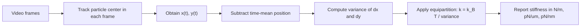
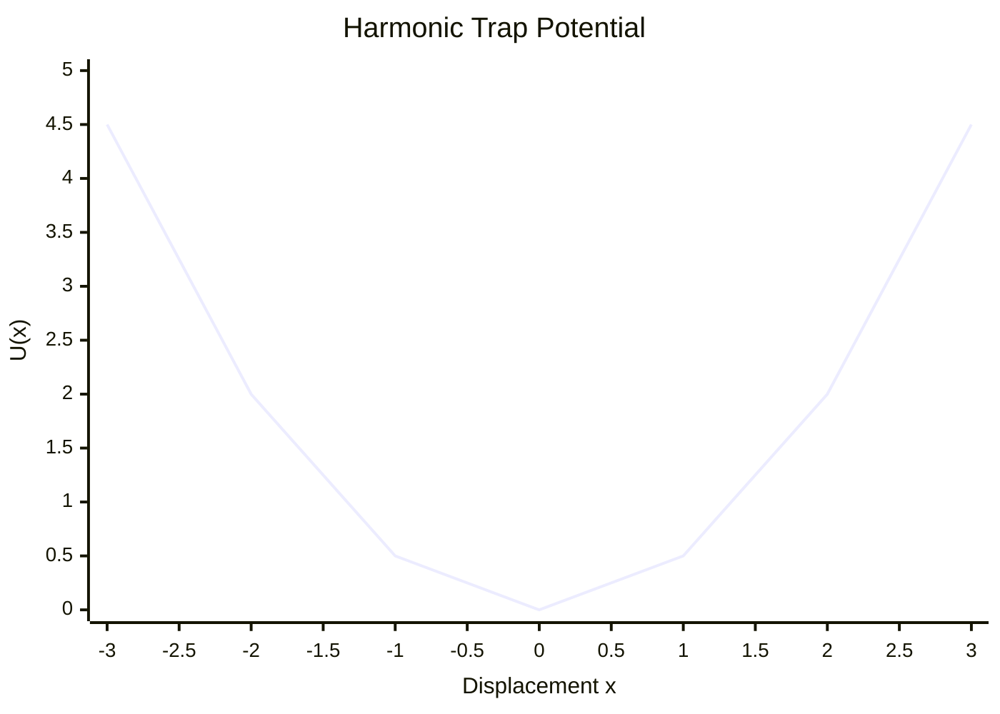
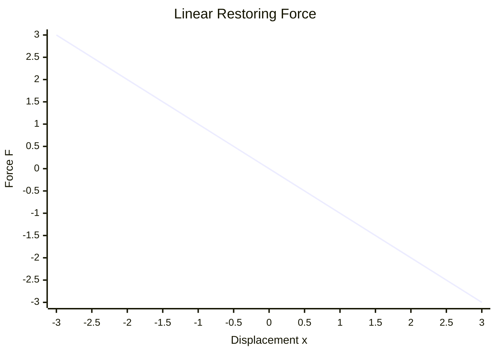

# Trap Stiffness Calculation: Physics Explanation

This note explains how the GUI estimates trap stiffness from tracked particle motion, in language intended for a physics audience rather than a programming audience.

## 1. Physical model behind the calculation

The GUI assumes that, near the trap center, the trapping potential is approximately harmonic along each Cartesian direction:

\[
U(x) = \frac{1}{2} k_x x^2, \qquad U(y) = \frac{1}{2} k_y y^2
\]

where:

- \(x\) and \(y\) are the particle displacements from the trap center
- \(k_x\) and \(k_y\) are the trap stiffnesses along the two axes

For a Brownian particle in thermal equilibrium, the equipartition theorem gives:

\[
\frac{1}{2} k_x \langle x^2 \rangle = \frac{1}{2} k_B T
\]

and similarly for \(y\):

\[
\frac{1}{2} k_y \langle y^2 \rangle = \frac{1}{2} k_B T
\]

So the stiffness is estimated from the positional variance:

\[
k_x = \frac{k_B T}{\langle x^2 \rangle}, \qquad
k_y = \frac{k_B T}{\langle y^2 \rangle}
\]

This is the core idea used by the app.

## 2. What the GUI measures first

The GUI tracks the particle center in each video frame and produces a time series:

\[
x_i,\; y_i \qquad (i = 1,2,\dots,N)
\]

It then computes the time-averaged position:

\[
\bar{x} = \frac{1}{N}\sum_{i=1}^N x_i, \qquad
\bar{y} = \frac{1}{N}\sum_{i=1}^N y_i
\]

and defines the fluctuation coordinates:

\[
\Delta x_i = x_i - \bar{x}, \qquad
\Delta y_i = y_i - \bar{y}
\]

These are the quantities stored in the output columns:

- `p1_dx`, `p1_dy`
- `p2_dx`, `p2_dy`
- etc.

So the stiffness is not calculated from the absolute position, but from the fluctuations around the mean position.

## 3. Variance used by the app

For each displacement column, the app computes the sample variance:

\[
s_x^2 = \frac{1}{N-1}\sum_{i=1}^N (\Delta x_i)^2
\]

\[
s_y^2 = \frac{1}{N-1}\sum_{i=1}^N (\Delta y_i)^2
\]

Then it uses the equipartition relation:

\[
k = \frac{k_B T}{s^2}
\]

provided that \(s^2\) is expressed in units of \(\text{m}^2\).

The Boltzmann constant used by the app is:

\[
k_B = 1.380649 \times 10^{-23}\ \text{J/K}
\]

and the GUI converts the user-entered temperature from Celsius to Kelvin:

\[
T(\text{K}) = T(^\circ\text{C}) + 273.15
\]

## 4. Conceptual flow of the calculation



## 5. What the trap looks like mathematically

The estimate assumes the particle explores only the approximately parabolic part of the trapping potential:

\[
U(x) \propto x^2
\]

so force is linear in displacement:

\[
F_x = -\frac{dU}{dx} = -k_x x
\]

That is just Hooke's law for the local trap response.

### Potential energy shape



### Force-displacement relation



A stiffer trap means:

- steeper potential well
- larger restoring force for the same displacement
- smaller thermal positional variance

So:

\[
\text{larger } k \;\Longleftrightarrow\; \text{smaller } \langle x^2 \rangle
\]

## 6. Why variance is enough

At thermal equilibrium, the probability density in one dimension is Gaussian:

\[
P(x) \propto \exp\left(-\frac{U(x)}{k_B T}\right)
= \exp\left(-\frac{k x^2}{2k_B T}\right)
\]

which is a normal distribution with variance:

\[
\sigma_x^2 = \frac{k_B T}{k_x}
\]

So simply measuring the width of the displacement distribution gives the stiffness.

### Distribution picture

```mermaid
xychart-beta
    title "Displacement Distribution"
    x-axis "x" -4 --> 4
    y-axis "P(x)" 0 --> 8
    line [0.2, 0.8, 2.5, 6.5, 8.0, 6.5, 2.5, 0.8, 0.2]
```

If the distribution becomes narrower, the inferred stiffness becomes larger.

## 7. Units reported by the GUI

The app reports stiffness in:

- `N/m`
- `pN/um`
- `pN/nm`

Useful conversions:

\[
1\ \text{N/m} = 10^6\ \text{pN}/\mu\text{m}
\]

\[
1\ \text{pN}/\mu\text{m} = 10^{-3}\ \text{pN}/\text{nm}
\]

## 8. What is axis-specific in this app

The app computes stiffness separately for every displacement column:

- `p1_dx` gives an \(x\)-direction stiffness estimate for particle 1
- `p1_dy` gives a \(y\)-direction stiffness estimate for particle 1

This means the result is effectively:

\[
k_x \text{ from } \Delta x(t), \qquad
k_y \text{ from } \Delta y(t)
\]

So anisotropy in the trap can appear as different values in `dx` and `dy`.

## 9. Important unit note about the current implementation

From the current code path in this project:

1. the tracked positions are already converted from pixels to micrometers before being written into the output table
2. the displacements `dx` and `dy` are therefore already in micrometers
3. the stiffness routine then computes the variance of those columns
4. after that, it multiplies by the pixel size once more when converting variance to SI units

So the code currently behaves as if:

\[
\text{variance in meters}^2
=
\text{variance of stored values} \times (\text{pixel size in meters})^2
\]

even though the stored values are already in micrometers, not in pixels.

### Physics-consistent form

If `dx` and `dy` are already in micrometers, the correct conversion to \(\text{m}^2\) should be:

\[
s^2_{\text{m}^2} = s^2_{\mu\text{m}^2} \times (10^{-6})^2
\]

not:

\[
s^2_{\mu\text{m}^2} \times (\text{pixel size in meters})^2
\]

So, for a physics interpretation:

- the intended method is clearly the equipartition method
- the present implementation appears to contain an extra pixel-size scaling step

This matters numerically, especially when the pixel size differs significantly from \(1\ \mu\text{m/pixel}\).

## 10. Practical interpretation

The GUI is therefore trying to answer:

> "How tightly is the particle confined, based on the size of its thermal fluctuations?"

The logic is:

- measure thermal motion
- compute fluctuation variance
- use \(k = k_B T / \langle x^2 \rangle\)

In plain physical terms:

- large fluctuations mean a weak trap
- small fluctuations mean a strong trap

## 11. Limits of the method

This method is reliable only if:

- the trap is approximately harmonic over the sampled region
- the particle is close to thermal equilibrium
- drift is small or removed
- calibration is correct
- tracking noise is much smaller than the real Brownian motion
- the sampling is long enough to estimate variance well

It can become misleading if:

- there is stage drift
- the trap is strongly nonlinear
- the particle is not actually trapped near a single stable minimum
- camera noise or localization noise broadens the distribution
- hydrodynamic or active forcing effects are significant

## 12. Short summary

The stiffness calculation used by the GUI is based on equipartition:

\[
k = \frac{k_B T}{\langle (\Delta x)^2 \rangle}
\]

and similarly for \(y\), where \(\Delta x\) and \(\Delta y\) are particle displacements relative to the time-averaged position.

So the app infers stiffness from the width of the Brownian fluctuation distribution. Narrower fluctuations imply a larger stiffness.

One important implementation detail in the current code is that the displacement table is already in micrometers, but the stiffness function appears to apply the pixel-size conversion again. The physical method is standard; that extra scaling step is the main point to verify if you want quantitatively correct stiffness values.
